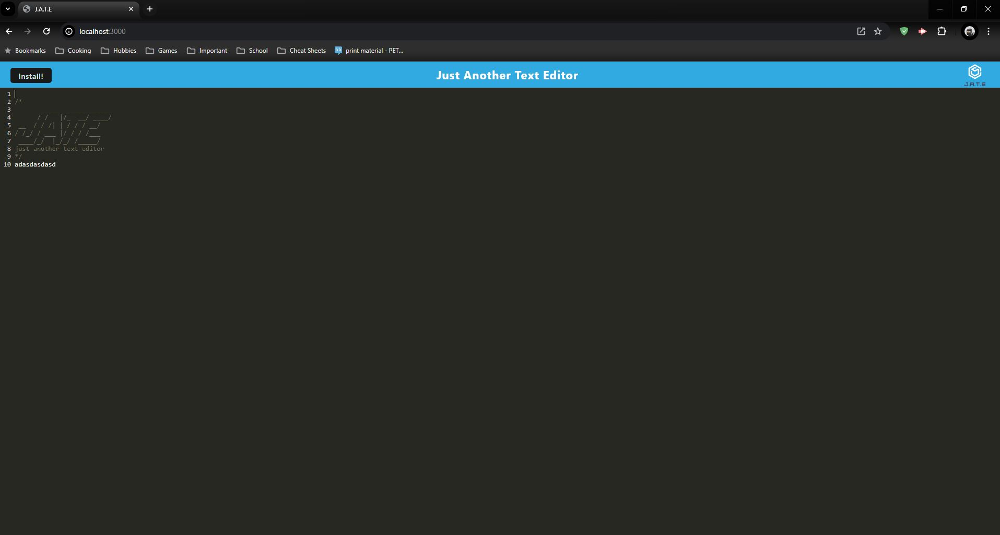

# E-commerce Design
This application was based off starter code our instructor Gary Almes gave us.

## Description
The main goal of this application was not to set it up fully, but to configure it properly so it can run as a PWA. The application itself is a text-editor that runs in the browser and it will be able to function offline if internet is unavailable.

## Visuals
*  Here is a screenshot of the JATE page.

## Usage
This application is a test of my knowledge and abilities to take starter-code that was given to me form our instructor and correctly functioning as a PWA.

## Acknowledgments
Thank you to all the many packages in this application for allowing me to use their packages. Among them are express, idb, and codemirrorthemes.

And thank you to GARY ALMES for providing the starter code for us.

## Support
If you have any issues with this repo, shoot me an email at walterty89@gmail.com. 

[Here is a link to my GitHub](https://github.com/TyWalter) if you would prefer to contact me this way.